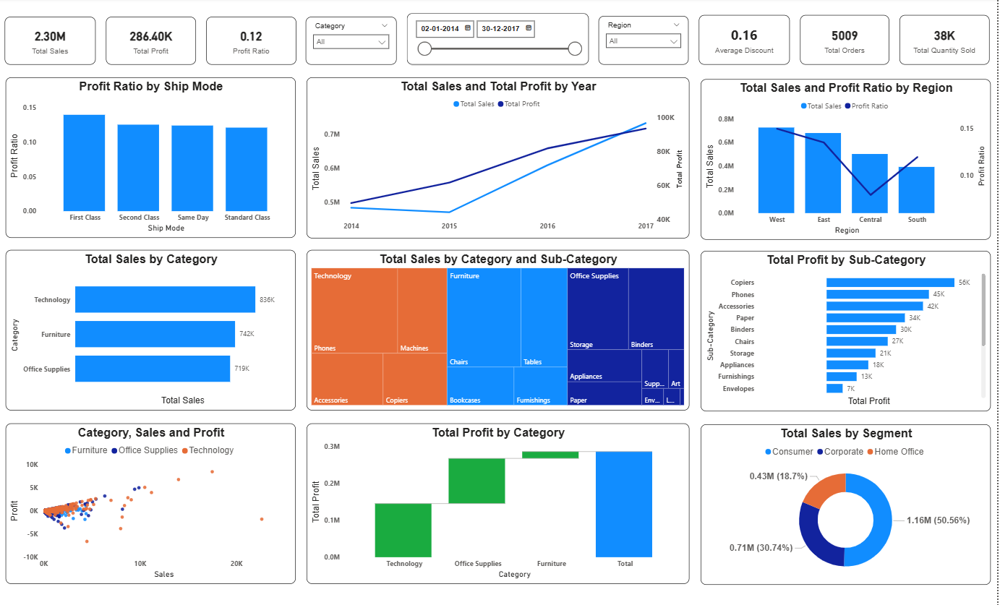

# 📊 Sales Performance Dashboard (Power BI)

## 🚀 Overview

An **interactive Sales & Profit Dashboard** built using **Power BI** to analyze business performance across **regions, categories, and customer segments**.

This project helps uncover key insights, track KPIs, and support **data-driven decision-making**.

---

## 🖼️ Dashboard Preview



---

## 📌 Key Features

* 📈 **KPIs at a glance**

  * Total Sales: 2.30M
  * Total Profit: 286.40K
  * Profit Ratio: 0.12
  * Total Orders: 5009
  * Quantity Sold: 38K

* 📊 **Interactive Visualizations**

  * Sales & Profit trend over years
  * Profit ratio by shipping mode
  * Sales & Profit by region
  * Category-wise and sub-category analysis
  * Segment-wise sales distribution

* 🎯 **Dynamic Filters**

  * Category filter
  * Region filter
  * Date range slicer

* 📉 **Advanced Insights**

  * Profitability comparison across categories
  * Loss-making vs high-performing products
  * Regional performance differences

---

## 🛠️ Tech Stack

| Tool        | Usage                          |
| ----------- | ------------------------------ |
| Power BI    | Data Visualization & Dashboard |
| Excel / CSV | Data Source                    |
| DAX         | Calculations & Measures        |

---

## 📂 Project Structure

```
sales-performance-dashboard/
│
├── data/               # Dataset used for analysis
├── images/             # Dashboard screenshots
├── README.md           # Project documentation
└── LICENSE             # License file
```

---

## 📊 Business Insights

* 🟢 **Technology** is the highest revenue-generating category
* 🔴 Some sub-categories show **negative profit despite high sales**
* 🌍 **West region** performs best in sales
* 📦 **First Class shipping** has the highest profit ratio
* 👥 **Consumer segment** contributes the largest share of sales

---

## 💡 Use Cases

* Business performance monitoring
* Sales trend analysis
* Identifying profitable segments
* Decision-making for inventory & logistics

---

## 📥 How to Use

1. Download the `.pbix` file (if uploaded)
2. Open in **Power BI Desktop**
3. Interact with filters and visuals

---


⭐ **If you found this useful, don’t forget to star the repo!**
